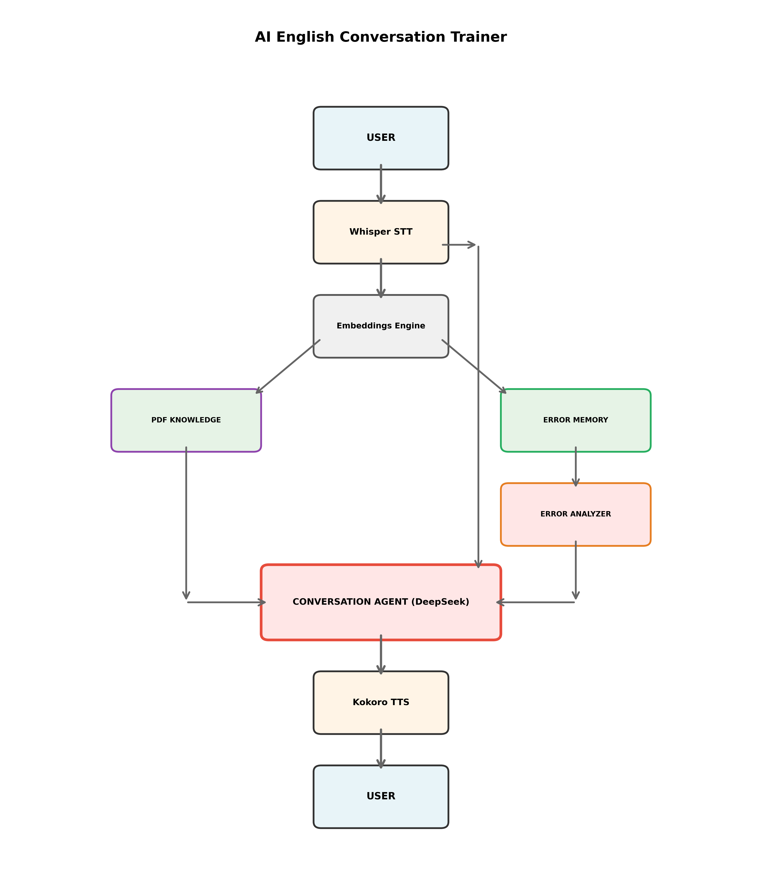

# AI English Conversation Trainer

Интерактивное приложение для практики разговорного английского языка с адаптивным обучением на основе AI.



## 🎯 Описание

Полностью голосовое приложение (speech-to-speech) для практики английского языка с AI-собеседником. Система анализирует ваши ошибки, запоминает слабые места и автоматически адаптирует практику под ваши потребности.

## 🏗️ Архитектура

1. USER
Голосовой ввод/вывод пользователя

2. Whisper STT
- Модель: `distil-whisper/distil-small.en`
- Дистиллированная версия Whisper для распознавания речи (в 6x быстрее оригинала, CPU).

3. Embeddings Engine
- Модель**: `sentence-transformers/all-MiniLM-L6-v2`
- Преобразование текста в векторные представления для семантического поиска.

4. PDF KNOWLEDGE
- База данных: ChromaDB (векторная БД)
- RAG система для хранения и поиска информации из загруженных PDF документов.

5. ERROR MEMORY
- База данных: ChromaDB (векторная БД, отдельная коллекция)
- RAG система для хранения истории ошибок и анализа слабых мест.

6. ERROR ANALYZER
- Модель: DeepSeek Chat API
- AI агент для анализа грамматических ошибок и выявления паттернов проблем.

7. CONVERSATION AGENT
- Модель: DeepSeek Chat API
- Основной AI собеседник с адаптивной практикой и поддержкой streaming.

8. Kokoro TTS
- Модель: Kokoro TTS
- Синтез речи с параллельной генерацией по предложениям.

## 🔄 Поток данных

### Основной цикл (Main Flow):
1. **USER** → Голосовое сообщение
2. **Whisper STT** → Транскрипция в текст
3. **CONVERSATION AGENT** → Генерация ответа (с учетом контекста и слабых мест)
4. **Kokoro TTS** → Синтез речи
5. **USER** → Прослушивание ответа

### Обработка знаний (Knowledge Flow):
1. **Whisper STT** → Текст пользователя
2. **Embeddings Engine** → Векторизация текста
3. **PDF KNOWLEDGE** → Поиск релевантного контекста
4. **CONVERSATION AGENT** → Использование контекста в диалоге

### Адаптивное обучение (Adaptive Learning Flow):
1. **Whisper STT** → Текст пользователя
2. **Embeddings Engine** → Векторизация
3. **ERROR MEMORY** → Сохранение текста
4. **ERROR ANALYZER** → Анализ ошибок
5. **ERROR MEMORY** → Обновление базы слабых мест
6. **CONVERSATION AGENT** → Адаптация практики

## ⚡ Оптимизации

### 1. Параллельная генерация TTS
- Текст разбивается на предложения
- Каждое предложение обрабатывается в отдельном потоке
- Результаты объединяются в единый аудио файл
- **Ускорение**: до 3x для длинных текстов

### 2. Streaming ответов AI
- Агент начинает генерировать TTS еще до завершения полного ответа
- TTS запускается параллельно для каждого готового предложения
- **Результат**: минимальная задержка до начала воспроизведения

### 3. Кэширование слабых мест
- Слабые места загружаются в фоновом режиме
- Доступ к кэшу занимает 0 секунд
- Обновление происходит после ответа пользователю

### 4. Фоновый анализ ошибок
- Анализ запускается после отправки ответа пользователю
- Не блокирует основной поток
- Пользователь может продолжать диалог без ожидания

## 🛠️ Технологический стек

| Компонент | Технология | Версия/Модель |
|-----------|-----------|---------------|
| **Backend Framework** | Streamlit | Latest |
| **Speech Recognition** | Whisper (distil) | distil-small.en |
| **Text-to-Speech** | Kokoro TTS | Latest |
| **LLM Provider** | DeepSeek API | deepseek-chat |
| **Vector Database** | ChromaDB | Latest |
| **Embeddings** | HuggingFace | all-MiniLM-L6-v2 |
| **RAG Framework** | Embedchain | Latest |
| **ML Framework** | PyTorch | Latest |
| **Audio Processing** | soundfile | Latest |

## 📦 Установка

```bash
# Клонирование репозитория
git clone <repository-url>
cd ai-english-conversation-trainer

# Установка зависимостей
pip install -r requirements.txt

# Запуск приложения
streamlit run english_trainer.py
```

## 🔑 Настройка

1. Получите API ключ от [DeepSeek](https://platform.deepseek.com/)
2. Введите ключ в интерфейсе приложения или установите в переменную окружения

## 🎓 Использование

### Базовая практика
1. Запустите приложение
2. Нажмите на кнопку микрофона
3. Произнесите фразу на английском
4. Получите ответ и обратную связь

### Практика с документом
1. Загрузите PDF файл в боковой панели
2. Ведите диалог на темы из документа
3. AI будет использовать контекст документа

### Адаптивное обучение
1. Включите "Adaptive Learning" в настройках
2. Система автоматически анализирует ваши ошибки
3. Практика адаптируется под ваши слабые места
4. Просмотрите статистику в "View My Weak Areas"

